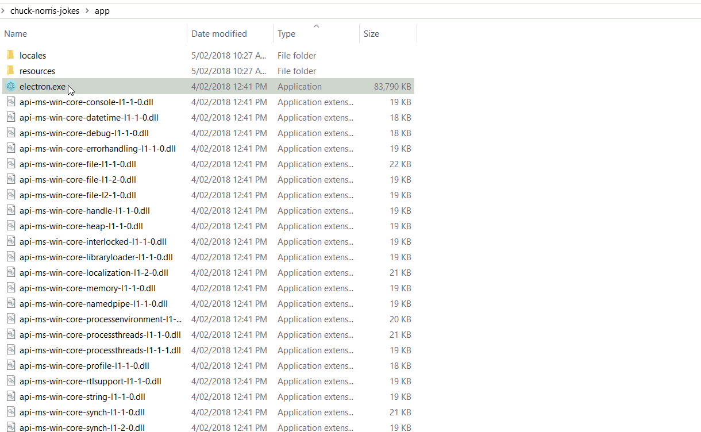
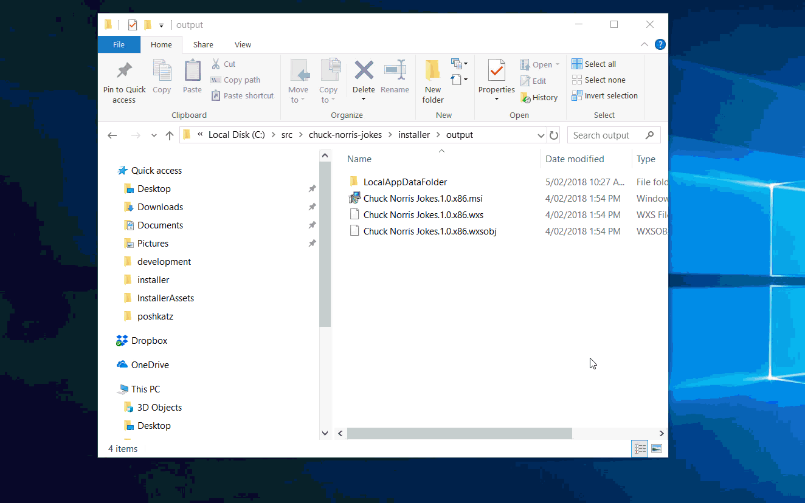

# Chuck Norris Jokes

An example Electron App with PowerShell Universal Dashboard and a PowerShell Pro Tools installer.

For a full explanation of this of this repository, read this [blog post](https://poshtools.com/2018/02/05/creating-desktop-app-universal-dashboard-installer-powershell-pro-tools/). 

## What you need to run this example

- [PowerShell Universal Dashboard](https://www.powershellgallery.com/packages/UniversalDashboard/1.4.1)
- [PowerShell Pro Tools cmdlets (1.3.0 or later)](https://www.powershellgallery.com/packages/PowerShellProTools/1.3.0) 

## Chuck Norris Jokes Electron App

## Chuck Norris Jokes Installer

